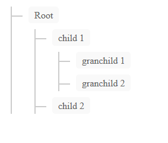

# PHPtreeview
PHP treeview

##
Simple library to generate a treeview with PHP.
It generates the html code from a multidimensional array.



## Install

Via Composer

``` bash
$ composer require mathiasbk/phptreeview
```

## Usage

``` php
$treeview = new PHPTreeView::Createphptreeview();

//add a button
$treeview->AddButton("test", "action.php", "btn btn-success");

$treeview->buildTreeView($data);
```